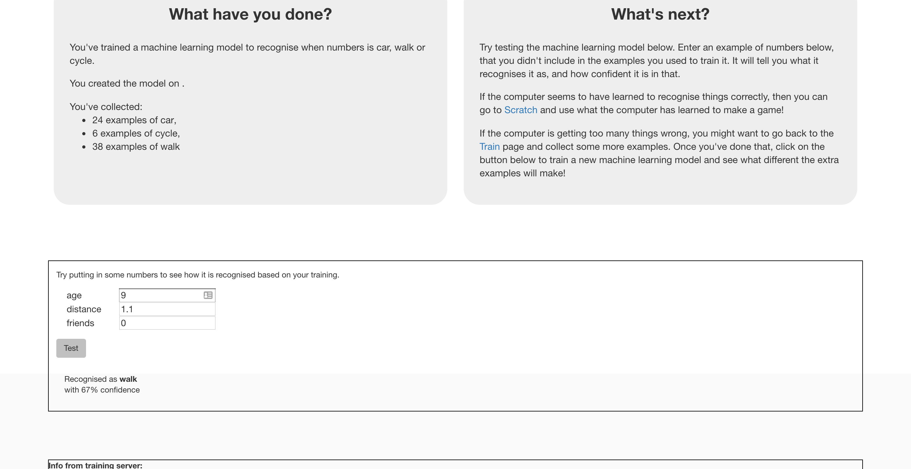

## Introduction

In this project you will train the computer to look for patterns in how your classmates get to school. You’ll test this training by getting the computer to predict how different people travel to school. 

### What you will make

--- collapse ---
---
title: What you will need
---

### Hardware
+ A computer with an internet connection

### Software
+ An account on machinelearningforkids.co.uk (optional)
--- /collapse ---

--- collapse ---
---
title: What you will learn
---
+ How to collect data by doing a survey
+ How to train a machine learning model to recognise numbers
+ How to use your trained machine learning model to predict things

--- /collapse ---

--- no-print ---

### Additional information for educators

If you need to print this project, please use the [printer-friendly version](https://projects.raspberrypi.org/en/projects/journey-to-school/print){:target="_blank"}.

[Here is a link to the resources for this project -TODO-](http://rpf.io/project-name-go).

Use the link in the footer to access the GitHub repository for this project, which contains all resources (including an example finished project) in the 'en/resources' folder.

--- /no-print ---

### License

This project is dual-licensed under both a [Creative Commons Attribution Non-Commercial Share-Alike License](http://creativecommons.org/licenses/by-nc-sa/4.0/){:target="_blank"} and an [Apache License Version 2.0](http://www.apache.org/licenses/LICENSE-2.0){:target="_blank"}