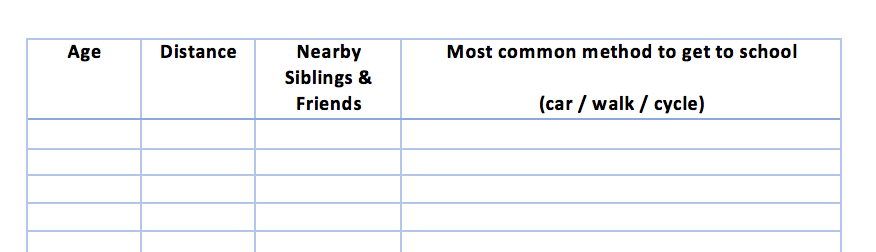
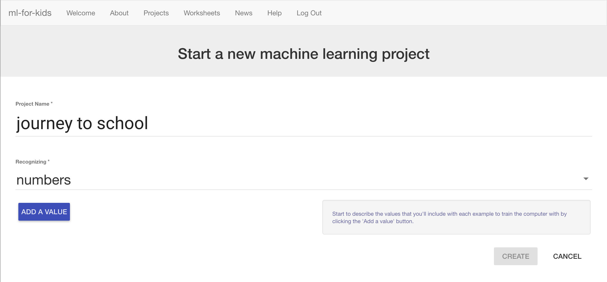
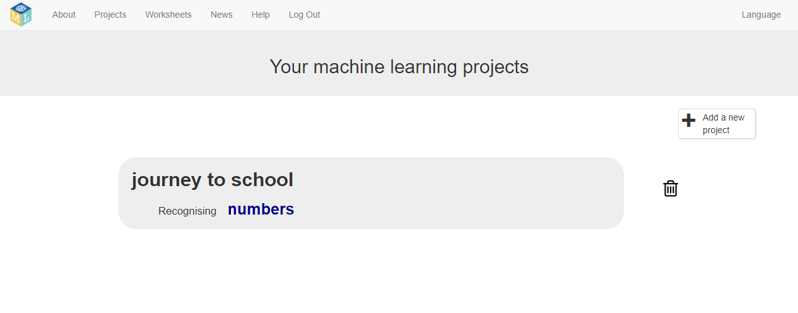

## Create a new project to recognise numbers

For this project, you will need to do a survey with your classmates. The more people you ask, the better! **Note:** If you cannot run a survey, that's OK. You can [find sample results here](https://github.com/raspberrypilearning/journey-to-school/en/resources){:target="_blank"}.

--- task ---

Write two or three questions to ask your classmates about how they travel to school. You need questions that they can answer with a number. You could use:
+ Age (in years)
+ Distance (miles from home to school)
+ Number of siblings or school friends who live nearby

But you can choose your own values. Make sure that the answers are numbers, and pick things that have something to do with their journey to school.

Draw up a table to collect the results, and then do your survey. Ask your classmates how they travel to school, as well as your questions. The more people you ask, the better. It is even better if you can ask people from different classes and years.

--- /task ---

--- task ---
Now, go back to the computer!

+ Go to [machinelearningforkids.co.uk](https://machinelearningforkids.co.uk/){:target="_blank"}

+ Click on **Get started**.

+ Click on **Try it now**.
--- /task ---

--- task ---
+ Click on **Projects** in the menu bar at the top of the page.

+ Click the **Add a new project** button.

+ Name your project `journey to school` and set it to learn how to recognise `numbers`. 

+ Click on **Add a value**. Name it `age` (or the value in the first column of your table) and make the type `number`. 

+ Click **Add another value**. Name the value `distance` (or the value in the second column of your table) and make the type `number`. 

+ Click **Add another value** one more time. Name the value `friends` (or the value in the third column of your table) and make the type `number`. 

+ When the page looks like the picture above, click on **Create**. 

+ You should now see `journey to school` in your list of projects. Click on the `journey to school` project.

--- /task ---
