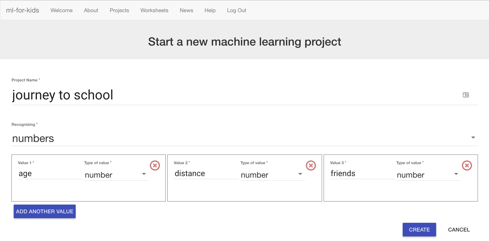

## Create new project to recognise numbers

First, create a project on machinelearningforkids.co.uk

--- task ---
+ Go to [machinelearningforkids.co.uk](https://machinelearningforkids.co.uk/)

++ Click on **Get Started**

+ **If** you have an account, click on **Log In** and type your username and password. Otherwise, click on **Try it now**
--- /task ---

--- task ---
+ Click on **Projects** on the top menu bar

+ Click the **+ Add a new project** button.

+ Name your project “Journey to school” and set it to learn how to recognise **“numbers”**. 

+ Click “Add a value”, name it “age” and make the type “number”. 

+ Do this again for a “number” value called “distance”. 

+ Do it a third time for a “number” value called “friends”. 

+ Click “Create” when it looks like the picture below. 

+ You should now see “journey to school” show up in the list of your
projects. Click on it.

--- /task ---