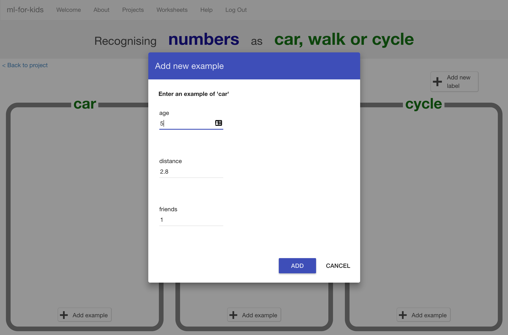

## Enter your survey data

--- task ---
+ Click on the **Train** button to start to give your survey results to the computer.

+ Now, you will create buckets to store the survey results. The names of your buckets will depend on the methods of transport that your classmates most often use. Click on **Add new label**, and create a bucket called `car`.

+ Now, create two more buckets called `walk` and `cycle`. 

If you received different answers in your survey, use those names instead.
--- /task ---

--- task ---
+ Click on the **Add example** button in the **car** bucket and then type in the first survey result for someone who travels by car. Then, click on **Add**. 

+ Repeat until you have entered all of the survey results.

--- /task ---
