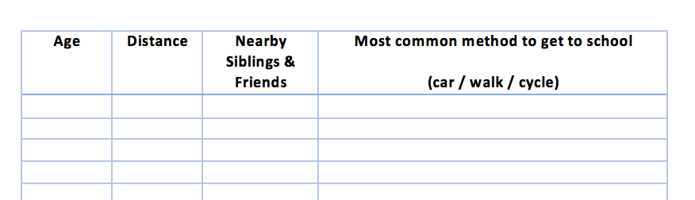
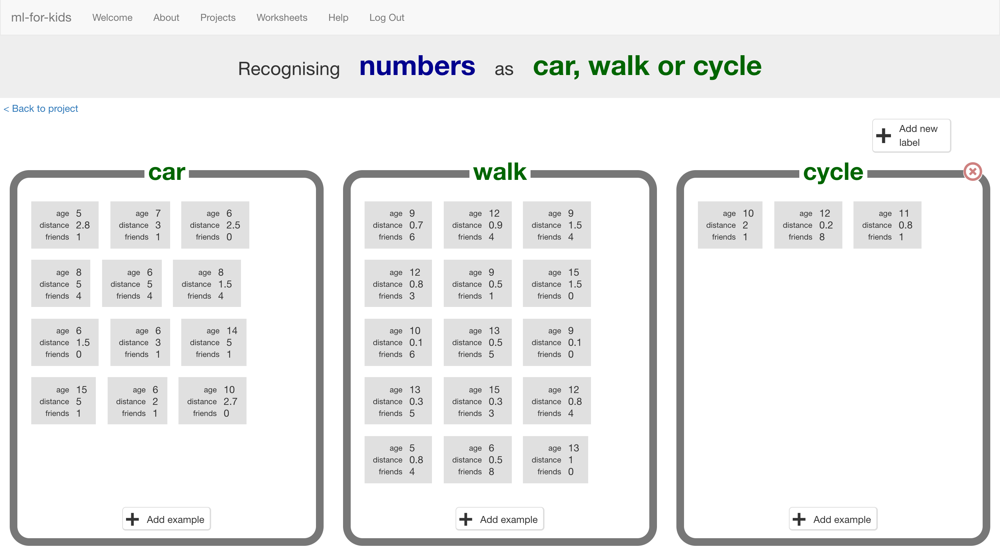

## Collect data
For this project, you will need to do a survey with your classmates. The more people you can ask, the better! **If you are not able to run a survey, that's no problem. You can find sample results [here](resources/)**

--- task ---
+ Write 2 or 3 questions you could ask your classmates that could affect how they travel to school. You need questions that they can answer with a number. For the rest of this worksheet, we’ll use:
Age (in years)
Distance (miles from home to school)
Number of siblings or school friends who live nearby
But you can choose your own values. Make sure that they are numbers, and pick things that could possibly have something to do with their journey to school.

+ Draw up a table to collect the results, and then go do your survey. Remember to ask how they travel to school as well as your questions. The more children you ask, the better. If you can ask children from different classes and years, even better.

--- /task ---

--- task ---
Now let's go back to the computer!
+ Click on the **Train** button to start giving your survey results to the
computer.

+ Click on **“Add new label”** and create a bucket called “car”.

+ Do it again and create a bucket called “walk”. 

+ Do it again for “cycle”.

If you used different options in your survey, use those names instead.
--- /task ---

--- task ---
+ Click on the “Add example” button in the “car” bucket and then type in the first survey result for someone who travels by car. 

+ Keep going until you’ve entered all the survey results.

--- /task ---