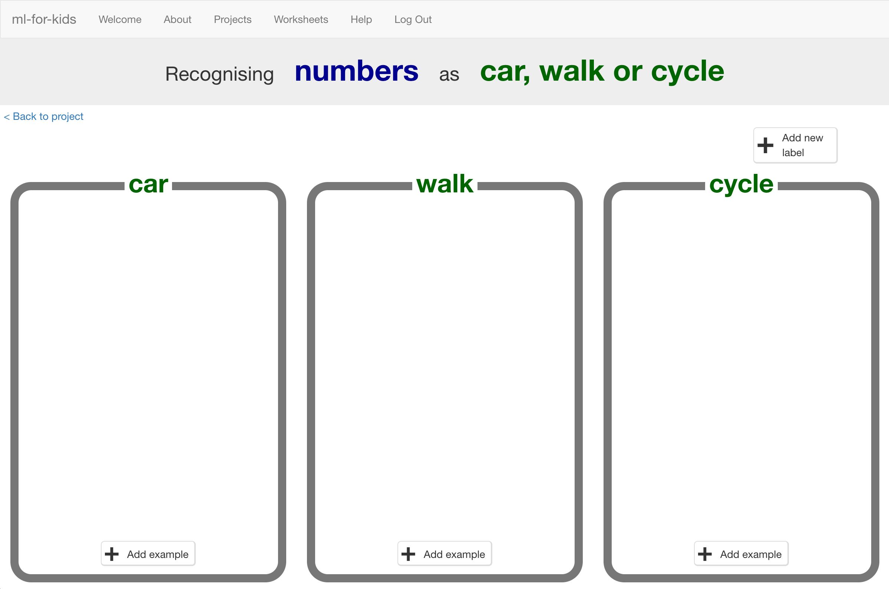

## Entering data

--- task ---
+ Click on the **Train** button to start giving your survey results to the
computer.

+ Click on **“Add new label”** and create a bucket called “car”.

+ Do it again and create a bucket called “walk”. 

+ Do it again for “cycle”.

If you used different options in your survey, use those names instead.
--- /task ---

--- task ---
+ Click on the “Add example” button in the “car” bucket and then type in the first survey result for someone who travels by car. 

+ Keep going until you’ve entered all the survey results.

--- /task ---