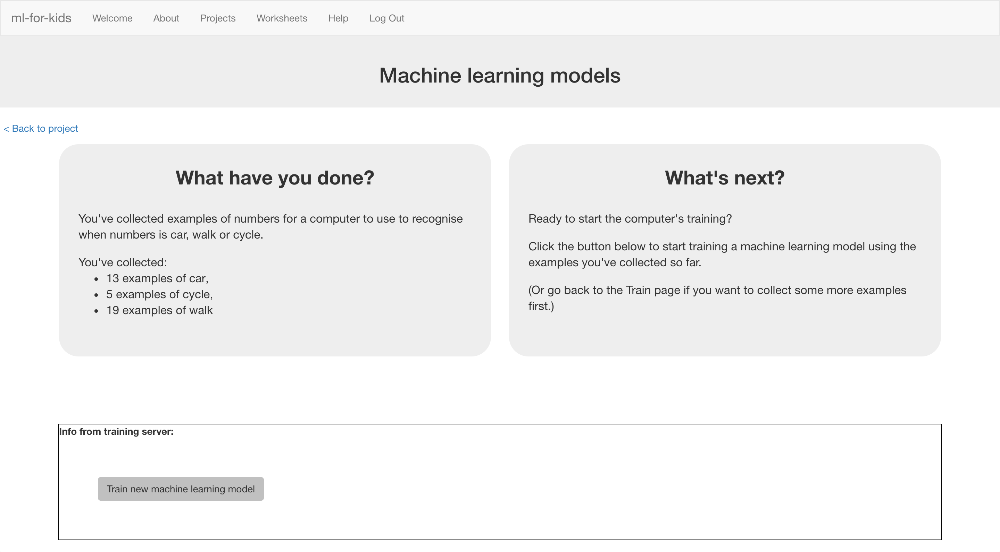
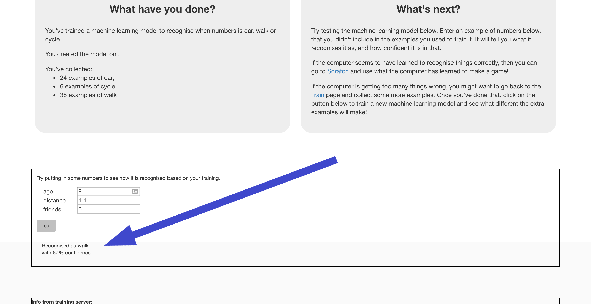

## Train new machine learning model
Now let's use your survey results to train the computer.

--- task ---

+ Click on the **“< Back to project”** link, and this time click on **Learn & Test** to use your examples

+ Click on the **Train new machine learning model** button. It should only take a few seconds to train. 

--- /task ---

--- task ---

Once training has finished, a Test box should appear. Use this to test your model.
+ Enter the values into the Test text boxes and press **Test**

+ Keep testing to try and work out the patterns that the computer has seen in your survey data.

As you make the age higher, does the computer think walking becomes more likely than going by car? If so, what’s the age where the computer seems to have seen the change?

--- /task ---

You’ve now trained a simple machine learning model using numbers from a travel survey.
You’ve created a “predictive model” – called that because we use models like this to make predictions.
You could use this model to make predictions for how likely someone is to walk to school if you know their age and how far they live from school.
But how accurate are the predictions? Let's test that next!