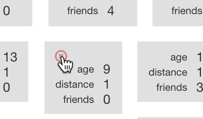

## Test your model

--- task ---
+ Click on **Back to project** to go back to the project page, then click on **Train** to go back to the **Train** page.

+ Choose one of the survey responses that you entered earlier. Write down all of the values of the survey response on a piece of paper, then delete the response from the bucket. To delete the response, hover the mouse cursor over the response, then click on the red cross that appears. 

--- /task ---

--- task ---
+ Click on **Back to project**, to go back to the project page, then click on **Learn & Test** to go back to the **Learn & Test** page.

+ Click on **Train new machine learning model**, as you did before.
--- /task ---

--- task ---
+ Once the new model has finished the training, take the values that you have written down and enter them into the Test boxes.

You know what the right answer for this is – it’s the bucket that you deleted this example from. Compare the computer’s prediction with the right answer. Did the computer get it right? 
--- /task ---

You’ve tested your predictive machine learning model to see how accurate it is.
By deleting the example from the computer’s training first, it means you tested it by asking it for the answer to a question it hadn’t seen before.
(If you test it on an example that it has seen before – that it has had to learn from in it’s training – then you can’t really tell if the computer has learned how to work out the answer for itself.)
But how fair a test was it?
Did you choose a really easy example? (Like a student who lives a really really long way from school!) Or did you choose a really hard example?
How could you have chosen an example to make it fair?
