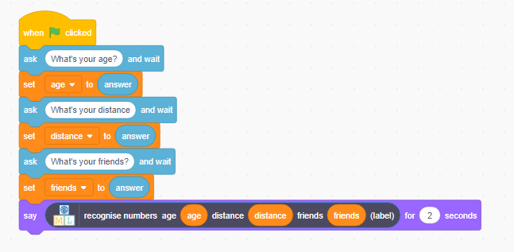

## Challenge: use your model in Scratch

--- challenge ---
Now that you have finished the project, you could try one of these projects, or think of a project of your own.

**Use this program in Scratch**

Can you guess what this piece of code will do in Scratch?

What about this one?

Can you think of a way to use the computer’s ability to predict how people travel to school in a game? Click **Make** to use your model in Scratch. If you like, you could use the examples above.

**Try bigger tests**

Instead of just deleting one example from the training data and using that to test, you could use more examples.

How many examples do you think you should use for testing?
+ If you use too few examples, you can’t be sure how good the computer is.
+ If you use too many examples, you reduce how many examples the computer has to learn from.
--- /challenge ---
