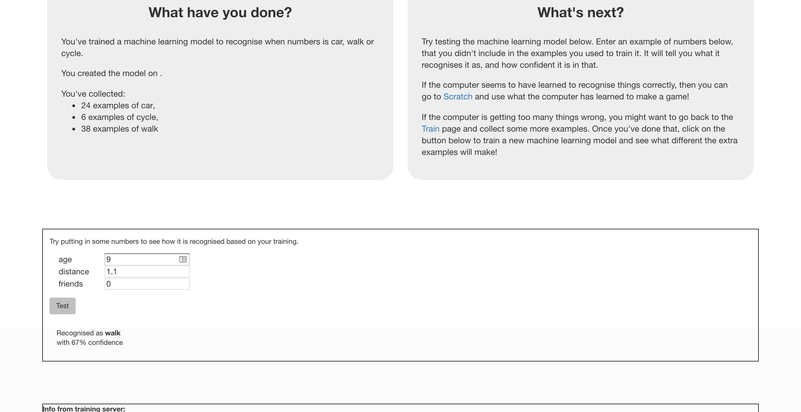

## परिचय

इस परियोजना में, आप अपने सहपाठियों को स्कूल जाने के तरीके के पैटर्न जानने के लिए कंप्यूटर को प्रशिक्षित करेंगे। यह अनुमान लगाने के लिए कि विभिन्न लोग स्कूल की यात्रा कैसे करते हैं आप कंप्यूटर का उपयोग करके इस प्रशिक्षण (training) का परीक्षण करेंगे ।

### आप क्या बनाएँगे

--- collapse ---
---
title: आपको किन चीजों की आवश्यकता होगी
---

+ एक इंटरनेट कनेक्शन के साथ कंप्यूटर

--- /collapse ---

--- collapse ---
---
title: आप क्या सीखेंगे
---
+ एक सर्वेक्षण (survey) करके कैसे डेटा इकट्ठा कर सकते है
+ संख्याओं को पहचानने के लिए मशीन लर्निंग मॉडल को कैसे प्रशिक्षित (train) किया जाए
+ पूर्वानुमान लगाने के लिए अपने प्रशिक्षित मशीन लर्निंग मॉडल का उपयोग कैसे करें

--- /collapse ---

--- collapse ---
---
title: शिक्षकों के लिए अतिरिक्त जानकारी
---

अगर आपको इस परियोजना को प्रिंट करने की आवश्यकता है, तो कृप्या [प्रिंटर-अनुकूल संस्करण](https://projects.raspberrypi.org/hi-IN/projects/journey-to-school/print){:target="_blank"} का उपयोग करें।

[इस परियोजना के संसाधनों के लिए यहाँ एक लिंक है](https://github.com/raspberrypilearning/journey-to-school/hi-IN/resources){:target="_blank"}।

--- /collapse ---

### लाइसेंस

यह परियोजना दोनों [Creative Commons Attribution Non-Commercial Share-Alike License](http://creativecommons.org/licenses/by-nc-sa/4.0/){:target="_blank"} और [Apache License Version 2.0](http://www.apache.org/licenses/LICENSE-2.0){:target="_blank"} के तहत डुअल-लाइसेंस है ।

हम इस परियोजना पर machinelearningforkids.co.uk से डेल को अपने सभी काम के लिए धन्यवाद देना चाहते हैं।
