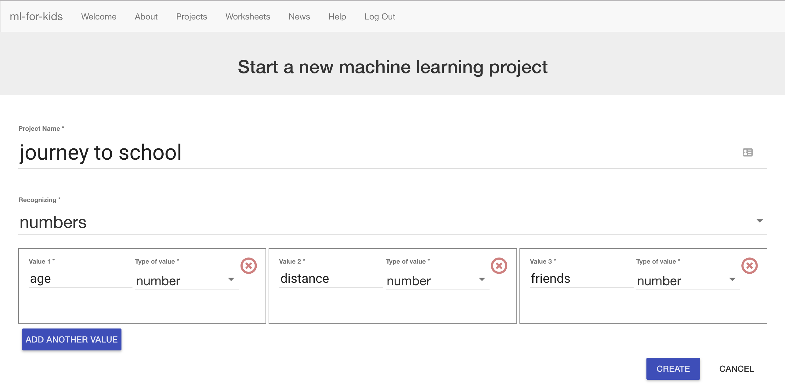

## संख्याओं को पहचानने के लिए एक नया प्रोजेक्ट बनाएं

इस परियोजना के लिए, आपको अपने सहपाठियों के साथ एक सर्वेक्षण करने की आवश्यकता होगी। आप जितने अधिक लोगों से पूछेंगे, उतना बेहतर होगा! **नोट:** यदि आप एक सर्वेक्षण नहीं कर​ सकते हैं, तो ठीक है। आप [यहाँ नमूने का परिणाम पा सकते हैं](https://github.com/raspberrypilearning/journey-to-school/en/resources){:target="_blank"}।

--- task ---

अपने सहपाठियों से दो या तीन प्रश्न पूछें कि वे स्कूल कैसे जाते हैं। आपको ऐसे प्रश्नों की जरुरत होगी जिसका वे एक संख्या के साथ उत्तर दे सकें। आप उपयोग कर सकते हैं:
+ आयु (वर्षों में)
+ दूरी (घर से स्कूल तक की दूरी)
+ आसपास रहने वाले भाई-बहनों या स्कूल के दोस्तों की संख्या

लेकिन आप अपने खुद के मूल्यों का चयन कर सकते हैं। सुनिश्चित करें कि उत्तर संख्याएं हैं, और उन चीजों को चुनें जिनका उनकी स्कूल की यात्रा के साथ कुछ लेना-देना हो।

परिणाम इकट्ठा करने के लिए एक तालिका बनाएं और फिर अपना सर्वेक्षण करें। अपने प्रश्नों के साथ ही साथ, सहपाठियों से पूछें कि वे कैसे स्कूल जाते हैं । आप जितने अधिक लोगों से पूछेंगे, उतना बेहतर होगा! यह और भी बेहतर है यदि आप विभिन्न वर्गों और वर्षों के लोगों से पूछ सकते हैं।  --- /task ---

--- task --- अब, कंप्यूटर पर वापस जाएं!

+ [machinelearningforkids.co.uk](https://machinelearningforkids.co.uk/){:target="_blank"} पर जाएं।

+ **Get started** पर क्लिक करें।

+ **Try it now** पर क्लिक करें। --- /task ---

--- task ---
+ पृष्ठ के शीर्ष पर मेन्यू बार में **Projects** पर क्लिक करें।

+ **Add a new project** बटन पर क्लिक करें।

+ अपनी परियोजना का नाम `journey to school` दें और इसे सेट करें कि `numbers` को कैसे पहचाना जाए। 

+ **Add a value** पर क्लिक करें। इसे नाम दें `age` (या अपनी तालिका के पहले कॉलम का मान) और इसका टाइप रखें `number`। 

+ **Add another value** पर क्लिक करें। मान का नाम रखें `distance` (या अपनी तालिका के दूसरे कॉलम का मान) और इसका टाइप रखें `number`।

+ **Add another value** पर एक और बार क्लिक करें। मान का नाम रखें `friends` (या अपनी तालिका के तीसरे कॉलम का मान) और इसका टाइप रखें `number`।

+ जब पृष्ठ ऊपर की तस्वीर जैसा दिखता है, तो **Create** पर क्लिक करें।

+ अब आपको अपनी परियोजनाओं की सूची में `journey to school` दिखना चाहिए। `journey to school` परियोजना पर क्लिक करें।  --- /task ---
