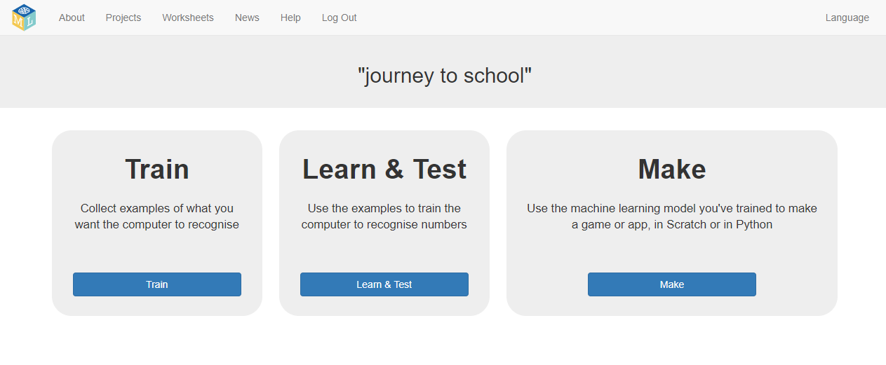

## अपना सर्वेक्षण (survey) डेटा दर्ज करें

--- task ---
+ कंप्यूटर को अपना सर्वेक्षण (survey) परिणाम देने के लिए **Train** बटन पर क्लिक करें। 

+ अब, आप सर्वेक्षण परिणामों को संग्रहीत करने के लिए बाल्टियाँ (buckets) बनाएंगे। आपके बाल्टियों (buckets) के नाम परिवहन के तरीकों पर निर्भर करते हैं जो आपके सहपाठी अक्सर उपयोग करते हैं। **Add new label** पर क्लिक करें, और `car` नामक एक बाल्टी (bucket) बनाएं।

+ अब, `walk` और `cycle` नामक दो और बाल्टियाँ (bucket) बनाएँ।

यदि आपको अपने सर्वेक्षण में अलग-अलग उत्तर मिले हैं, तो इसके बजाय उन नामों का उपयोग करें। --- /task ---

--- task ---
+ **car** बाल्टी (bucket) में **Add example** बटन पर क्लिक करें और फिर कार से यात्रा करने वाले किसी व्यक्ति के लिए पहले सर्वेक्षण परिणाम को टाइप करें। फिर, **Add** पर क्लिक करें। 

+ जब तक आप सभी सर्वेक्षण परिणामों को दर्ज नहीं कर लेते, तब तक दोहराएं। 

--- /task ---
