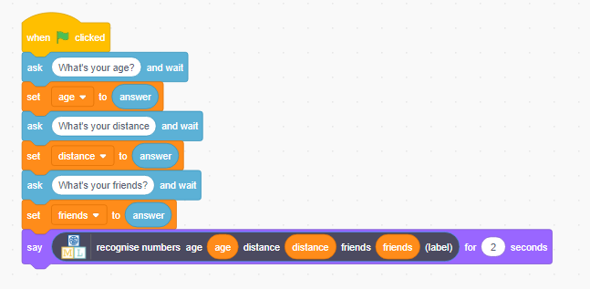
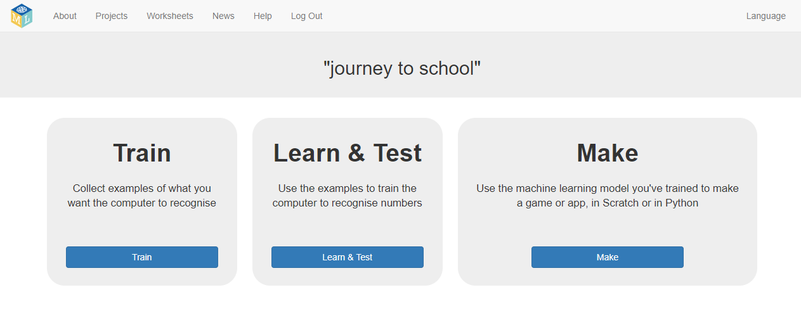

## चुनौती: Scratch में अपने मॉडल का उपयोग करें

--- challenge --- अब जब आपने परियोजना पूरी कर ली है, तो आप इनमें से किसी एक परियोजना को आजमा सकते हैं, या अपनी खुद की एक परियोजना के बारे में सोच सकते हैं।

**Scratch में इस प्रोग्राम का उपयोग करें**

क्या आप अनुमान लगा सकते हैं कि यह कोड Scratch में क्या करेगा? 

और इसका क्या? 

क्या आप एक​ तरीका सोच​ सकते हैं कंप्यूटर की क्षमता का उपयोग करके अनुमान लगाना कि लोग स्कूल की यात्रा कैसे करते हैं गेम​ में? Scratch में अपने मॉडल का उपयोग करने के लिए **Make** पर क्लिक करें। यदि आप चाहें, तो आप ऊपर दिए गए उदाहरणों का उपयोग कर सकते हैं। 

**बड़े परीक्षण का प्रयास करें**

प्रशिक्षण डेटा से केवल एक उदाहरण को हटाने और परीक्षण करने के लिए उपयोग करने के बजाय, आप अधिक उदाहरणों का उपयोग कर सकते हैं।

आपको क्या लगता है कि आपको परीक्षण के लिए कितने उदाहरणों का उपयोग करना चाहिए?
+ यदि आप बहुत कम उदाहरणों का उपयोग करते हैं, तो आप यह सुनिश्चित नहीं कर सकते कि कंप्यूटर कितना अच्छा है।
+ यदि आप बहुत सारे उदाहरणों का उपयोग करते हैं, तो आप कम कर देते हैं कि कंप्यूटर को कितने उदाहरणों से सीखना है। --- /challenge ---
