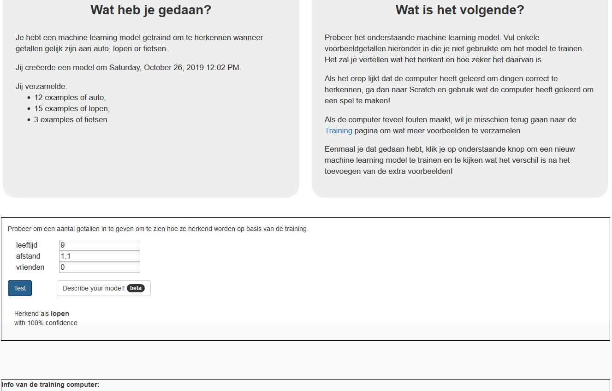

## Inleiding

In dit project ga je de computer trainen om patronen te zoeken in hoe je klasgenoten naar school gaan. Je test deze training door de computer te laten voorspellen hoe verschillende mensen naar school reizen.

### Wat ga je maken

--- collapse ---
---
title: Wat heb je nodig
---

+ Een computer met een internetverbinding

--- /collapse ---

--- collapse ---
---
title: Wat ga je leren
---
+ Hoe gegevens te verzamelen door een enquête in te vullen
+ Hoe een machine learning-model te trainen om getallen te herkennen
+ Hoe je je getrainde machine learning-model kunt gebruiken om voorspellingen te doen

--- /collapse ---

--- collapse ---
---
title: Aanvullende informatie voor docenten
---

Als je dit project wilt afdrukken, gebruik dan de [printervriendelijke versie](https://projects.raspberrypi.org/en/projects/journey-to-school/print){:target="_ blank"}.

[Hier is een link naar de bronnen voor dit project](https://github.com/raspberrypilearning/journey-to-school/en/resources){:target="_blank"}.

--- /collapse ---

### Licentie

Dit project heeft een dubbele licentie onder zowel een [Creative Commons Attribution Non-Commercial Share-Alike-licentie](http://creativecommons.org/licenses/by-nc-sa/4.0/){:target="_blank"} en een [Apache-licentie versie 2.0](http://www.apache.org/licenses/LICENSE-2.0){:target="_blank"}

We willen Dale van machinelearningforkids.co.uk graag bedanken voor al zijn werk aan dit project.
