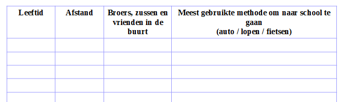
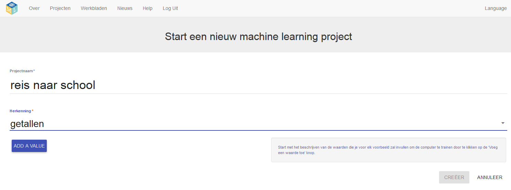
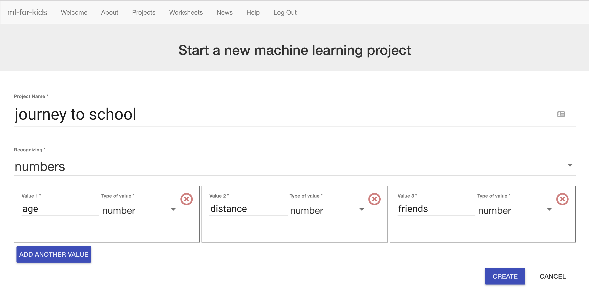
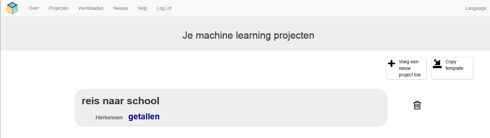

## Maak een nieuw project om getallen te herkennen

Voor dit project moet je een enquête houden met je klasgenoten. Hoe meer mensen je vraagt, hoe beter! **Opmerking:** Als je geen enquête kunt uitvoeren, is dat OK. Je kunt [hier voorbeeldresultaten vinden](https://github.com/raspberrypilearning/journey-to-school/nl-NL/resources){:target="_blank"}.

--- task ---

Schrijf twee of drie vragen om je klasgenoten te vragen hoe ze naar school reizen. Je hebt vragen nodig die zij met een getal kunnen beantwoorden. Je zou kunnen gebruiken:
+ Leeftijd (in jaren)
+ Afstand (kilometers van huis naar school)
+ Aantal broers en zussen of schoolvrienden die in de buurt wonen

Maar je kunt je eigen waarden kiezen. Zorg ervoor dat de antwoorden getallen zijn en kies dingen die iets te maken hebben met hun reis naar school.

Maak een tabel om de resultaten te verzamelen en voer vervolgens je enquête uit. Vraag je klasgenoten hoe ze naar school reizen en stel je eigen vragen. Hoe meer mensen je vraagt, hoe beter. Het is nog beter als je mensen uit verschillende klassen en jaren kunt vragen.  --- /task ---

--- task --- Ga nu terug naar de computer!

+ Ga naar [machinelearningforkids.co.uk](https://machinelearningforkids.co.uk/){:target="_blank"}

+ Klik op **Begin**.

+ Klik op **Probeer nu**. --- /task ---

--- task ---
+ Klik op **Projecten** in de menubalk bovenaan de pagina.

+ Klik op de knop **Voeg een nieuw project toe**.

+ Noem je project `reis naar school`, stel het in om te leren hoe je `getallen` kunt herkennen en stel de taal in op Dutch (Nederlands). 

+ Klik op **Add a value**. Noem het `leeftijd` (of de waarde in de eerste kolom van je tabel) en geef het type `getal`. 

+ Klik op **Add another value**. Noem de waarde `afstand` (of de waarde in de tweede kolom van je tabel) en geef het type `getal`.

+ Klik nog een keer op **Add another value**. Noem de waarde `vrienden` (of de waarde in de derde kolom van je tabel) en geef het type `getal`.

+ Wanneer de pagina eruitziet zoals op de bovenstaande afbeelding, klik je op **Creëer**.

+ Je zou nu `reis naar school` in je lijst met projecten moeten zien. Klik op het project `reis naar school`.  --- /task ---
