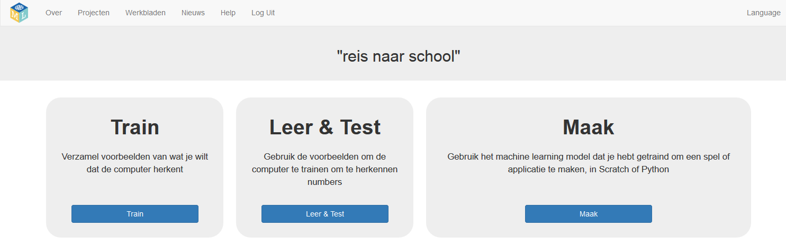

## Voer je enquêtegegevens in

\--- task \---
+ Klik op de knop **Train** om je enquêteresultaten aan de computer te geven. 

+ Je gaat nu containers maken om de onderzoeksresultaten op te slaan. De namen van je containers zijn afhankelijk van de transportmethoden die je klasgenoten het vaakst gebruiken. Klik op **Voeg een nieuw label toe** en maak een container met de naam `auto`.

+ Maak nu nog twee containers genaamd `lopen` en `fietsen`.

Als je verschillende antwoorden hebt ontvangen in je enquête, gebruik dan die namen. \--- /task \---

\--- task \---
+ Klik op de knop **Voeg een voorbeeld toe** in de container voor **auto** en typ vervolgens het eerste enquêteresultaat voor iemand die met de auto reist. Klik vervolgens op **Voeg toe**. 

+ Herhaal dit totdat je alle enquêteresultaten hebt ingevoerd. 

\--- /task \---
