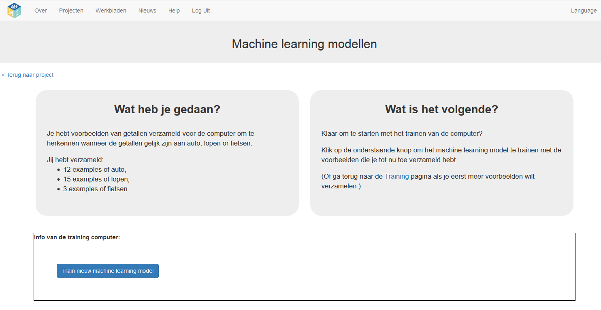
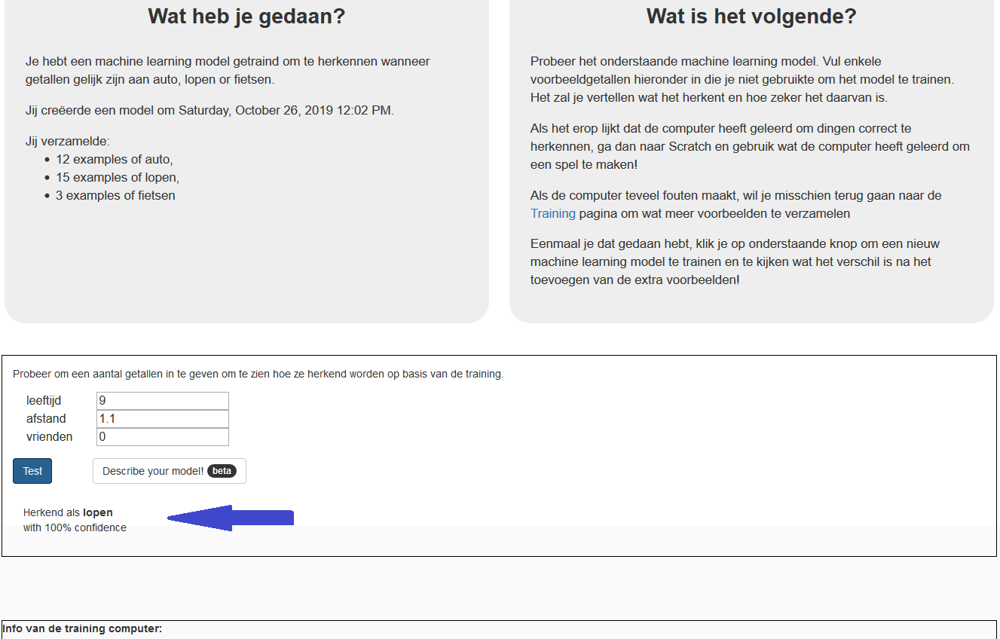

## Train een nieuw model voor machine learning
Nu ga je je enquêteresultaten gebruiken om de computer te trainen.

--- task ---

+ Klik op **Terug naar project** in de linkerbovenhoek om terug te keren naar de projectpagina. Klik vervolgens op **Leer & Test** om je voorbeelden te gebruiken.

+ Klik op de knop **Train nieuwe machine learning model**. Het duurt maar een paar seconden om te trainen. 

--- /task ---

--- task ---

Nadat de training is voltooid, verschijnt er een testvak. Gebruik dit om je model te testen.
+ Voer de waarden in de testtekstvakken in en klik op **Test**. 

+ Blijf testen om te proberen de patronen uit te werken die de computer in je enquêtegegevens heeft gezien.

Denkt de computer naarmate je ouder wordt, dat lopen waarschijnlijker wordt dan met de auto gaan? Zo ja, op welke leeftijd lijkt de computer de verandering te hebben gezien?

--- /task ---

Je hebt nu cijfers uit een reisenquête gebruikt om een eenvoudig machine learning-model te trainen. Je hebt een **voorspellend model** gecreëerd (een voorspellend model genoemd, omdat we gebruik maken van modellen zoals deze om voorspellingen te doen). Je zou dit model kunnen gebruiken om voorspellingen te doen over hoe waarschijnlijk het is dat iemand naar school loopt op basis van zijn leeftijd en hoe ver hij of zij van school woont. Maar hoe nauwkeurig zijn de voorspellingen? Je zult dat in de volgende stap testen.
