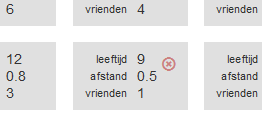

## Test je model

--- task ---
+ Klik op **Terug naar project** om terug te gaan naar de projectpagina en klik vervolgens op **Train** om terug te gaan naar de **Train** pagina.

+ Kies een van de antwoorden die je eerder hebt ingevoerd. Noteer alle waarden van het onderzoeksantwoord op een stuk papier en verwijder vervolgens het antwoord uit de container. Om het antwoord te verwijderen, beweeg je de muiscursor over het antwoord en klik je op het rode kruis dat verschijnt.  --- /task ---

--- task ---
+ Klik op **Terug naar project** om terug te gaan naar de projectpagina en klik vervolgens op **Leer & Test** om terug te gaan naar de pagina **Leer & Test**.

+ Klik op **Train nieuw machine learning model**, zoals je eerder deed. --- /task ---

--- task ---
+ Nadat het nieuwe model de training heeft voltooid, neem je de waarden die je hebt genoteerd en voer je deze in de testvakken in.

Je weet het juiste antwoord voor deze test - het is de container waaruit je het voorbeeld hebt verwijderd. Vergelijk de voorspelling van de computer met het juiste antwoord. Heeft de computer het goed gedaan? --- /task ---

Je hebt nu je voorspellend machine learning-model getest om te zien hoe nauwkeurig het is. Je vroeg de computer om het antwoord op een vraag die hij nog niet eerder had gezien (omdat je het voorbeeld vóór de test uit de training van de computer had verwijderd). Als je de computer test op een voorbeeld dat het eerder heeft gezien en dat het daarom in zijn training heeft geleerd, dan kun je niet echt zeggen of de computer heeft geleerd hoe hij het antwoord zelf moet uitwerken.

+ Maar hoe eerlijk was het?
+ Heb je een heel eenvoudig voorbeeld gekozen? (Zoals een leerling die heel, heel ver van school woont!)
+ Of heb je een heel moeilijk voorbeeld gekozen?
+ Hoe had je een voorbeeld kunnen kiezen om het eerlijk te maken?
