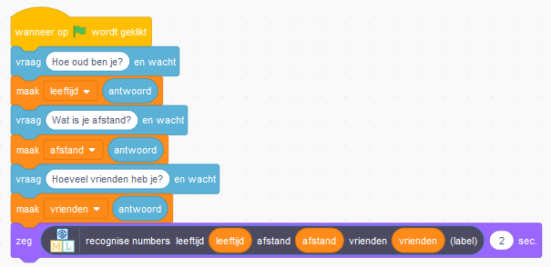

## Uitdaging: gebruik je model in Scratch

\--- challenge \--- Nu je het project hebt voltooid, kun je een van deze projecten proberen of een eigen project bedenken.

**Gebruik dit programma in Scratch**

Kun je raden wat dit stukje code in Scratch zal doen? 

Wat dacht je van deze? 

Kun je een manier bedenken om het vermogen van de computer te gebruiken in een game om te voorspellen hoe mensen naar school reizen? Klik op **Maak** om je model in Scratch te gebruiken. Als je wilt, kun je de bovenstaande voorbeelden gebruiken. 

**Probeer grotere tests**

In plaats van slechts één voorbeeld uit de trainingsgegevens te verwijderen en dat te gebruiken om te testen, kun je meer voorbeelden gebruiken.

Hoeveel voorbeelden denk je dat je moet gebruiken om te testen?
+ Als je te weinig voorbeelden gebruikt, weet je niet zeker hoe goed de computer is.
+ Als je te veel voorbeelden gebruikt, verminder je hoeveel voorbeelden de computer moet leren. \--- /challenge \---
